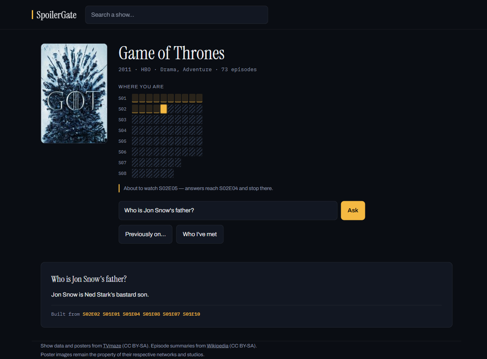
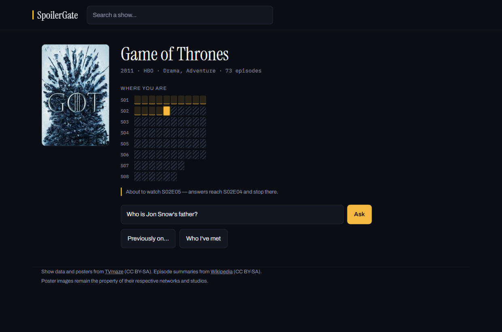

<h1 align="center">SpoilerGate</h1>

<p align="center">
  Ask anything about a show you're part-way through.<br>
  Every answer is built <em>only</em> from episodes you've already watched.
</p>

<p align="center">
  <a href="https://spoilergate.onrender.com"><strong>Try it live →</strong></a>
</p>

<p align="center">
  
  
  <a href="https://github.com/VamP08/spoilergate/actions/workflows/tests.yml"></a>
</p>



That answer is right *for that position*. Jon's real parentage is a season-six
reveal — any model that has read the internet will hand it to you. This one only
knows what you know.

## How it works

Three gates. Only the last one involves the model at all.

| | |
|---|---|
| **Question shape** | "Does she die?", "is he still around at the end?" — refused before anything is retrieved. The summaries record what *has* happened, never what hasn't, so an answer claiming someone is safe is unsupported whatever comes back. |
| **Retrieval** | `WHERE abs_order <= your_position`. The model never receives a summary from an episode you haven't reached. |
| **Output scan** | The answer is checked against every character the show introduces later. A name from your future blocks it. |

A character you haven't met yet gets the same answer as one who doesn't exist —
saying "I can't tell you *yet*" would confirm they turn up.

## Features

- **Ask** — free-form questions, answered from your watched range, episodes cited
- **Previously on…** — a recap that stops exactly where you did
- **Characters** — only the people you've met, each with a spoiler-safe profile
- **832 shows** pre-indexed; anything else indexes itself in about four seconds
- Runs with **no API key at all** — answers fall back to the gated summaries themselves

## Screenshots

| Browse | Set your position |
|---|---|
|  |  |

Every episode is a cell. Watched ones are lit, everything past your position is
hatched out, and you click to move the line.

## Quick start

```bash
conda create -n spoilergate python=3.12 -y --override-channels -c conda-forge
conda activate spoilergate
pip install -r requirements.txt

cp .env.example .env          # add a Groq / Gemini / Cerebras / OpenRouter key
python -m ingest.build_db "Breaking Bad" "Severance"
python -m ingest.build_db --entities
uvicorn server.app:app
```

Open http://127.0.0.1:8000. Or skip all of it and use the
[hosted instance](https://spoilergate.onrender.com) — it sleeps when idle, so
the first load after a quiet spell takes about a minute to wake.

`python -m ingest.build_db --top 1500` builds the full index instead. It takes
hours and is resumable — rerun the same command.

## Results

The gate is measured, not asserted. Every character knows the episode it first
appears in, so each one generates a question whose correct behaviour is known:
asked one episode earlier it must be refused, asked on the reveal episode it
should be answered. Answers are recorded with the output scan **off** and scored
afterwards — scoring guarded output with the same scan the guard uses would be
circular.

144 questions across Breaking Bad, Game of Thrones and Arrow:

| | |
|---|---|
| Asked one episode too early | 35 of 36 refused |
| …the one that answered | caught by the output scan — **0 leaks after all three gates** |
| "Does she die?", "how does it end?" | 72 of 72 refused |
| Answers re-read by a model for implied spoilers | 0 leaks in 31 |
| Asked on the reveal episode | 31 of 36 answered |

```bash
python -m eval.run "Breaking Bad"    # record answers
python -m eval.judge_run             # second-pass spoiler judge
python -m eval.score                 # scores, costs nothing to re-run
```

## Known limits

- 832 of the 1,499 most popular shows have Wikipedia episode summaries; the rest
  are mostly reality, talk and non-English series. Search hides shows that can't
  answer anything.
- Character extraction suits serialised fiction. Sketch and reality shows link
  real people constantly, so their "characters" are mostly guests.
- Vague questions ("what's the biggest twist?") have no name to retrieve on.
- The five "should have answered" misses above were all non-characters — a poet
  quoted in a book, a company, a location. The gate answered every real character
  correctly; the denominator carries some rubbish.
- On a free host the filesystem is wiped whenever the service sleeps, so a show
  someone indexed lives until then unless `DATABASE_URL` is set. Your position is
  different — it stays in your browser and is never sent anywhere.

## Data

Episode ordering and posters from [TVmaze](https://www.tvmaze.com), episode
summaries from [Wikipedia](https://en.wikipedia.org), both CC BY-SA and
attributed per episode. Characters are dated without a model: Wikipedia links a
character on first mention inside a summary, and TVmaze's cast list supplies the
leads that episode tables never link.

Posters are hotlinked from TVmaze and remain the property of their networks.

## Licence

MIT for the code — see [LICENSE](LICENSE). The index it builds is derived from
CC BY-SA sources and stays under those terms.
